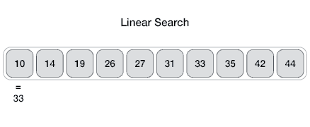
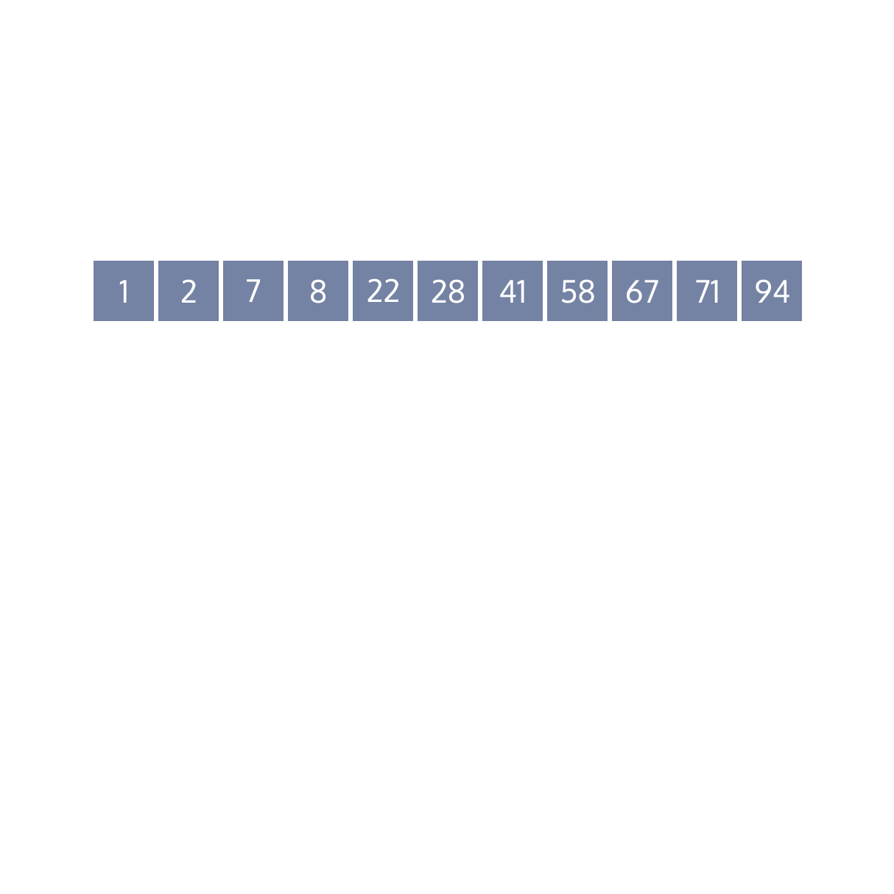

# 1. Cây 
## 1.1. Cây tìm kiếm nhị phân:
  - Là Cây nhị phân thoả mãn điều kiện:
    + Nút khoá cha có khoá nhỏ hơn khoá của tất cả các nút của cây con bên phải và lớn hơn khoá của tất cả các nút của cây con bên trái.
    + Nút con bên phải và nút con bên trái cũng là cây tìm kiếm nhị phân.

[CODE](tree/BinarySearchTree.cpp)

# 2. Sắp xếp
## 2.1. Sắp xếp nổi bọt - Bubble Sort
  
  
  [CODE](sort/sortSlow/BubbleSort.cpp)
## 2.2. Sắp xếp chọn - Selecion Sort 
  
  
  [CODE](sort/sortSlow/SelecionSort.cpp)
## 2.3. Sắp xếp chèn - Insertion Sort
  

  [CODE](sort/sortSlow/InsertionSort.cpp)
## 2.4. Sắp xếp nhanh - Quick Sort 
  

  [CODE](sort/sortFast/QuickSort.cpp)
## 2.5. Sắp xếp trộn – Merge Sort
  

  [CODE](sort/sortFast/MergeSort.cpp)
## 2.6. Sắp xếp vun đống – Heap Sort
  

  [CODE](sort/sortFast/HeapSort.cpp)
# 3. Tìm kiếm
## 3.1. Tìm kiếm tuần tự - Sequence search / Linear search
  

  [CODE](./search/LinearSearch.cpp)
## 3.2. Tìm kiếm nhị phân - Binary search
  

  [CODE](./search/BinarySearch.cpp)
## 3.3. Bảng băm - Hash table

  [CODE](./search/HashTable.cpp)